# Universidad [TECNICA DE AMBATO]
## Facultad de [FACULTAD INGENIERIA EN SISTEMAS, ELECTRONICA E IDUSTRIAL]
### Carrera de [INGENIERIA EN SOFTWARE]

**Asignatura:** Manejo y Configuración de Software  
**Nombre del Estudiante:** Peñaloza Peñaloza Alan Justin 
**Fecha:** 23/09/2026

---

# Evaluación Práctica de Git y GitHub

## Instrucciones Generales

- Cada pregunta debe ser respondida directamente en este archivo **(README.md)** debajo del enunciado correspondiente. 
- Es importante que se coloque capturas de pantalla como evidencia de la parte práctica. Se recomienda crear una carpeta `images/` para almacenar las capturas de pantalla.
- Cada respuesta debe ir acompañada de uno o más **commits**, según se indique en cada pregunta.
- Cuando se indique, deberán realizarse acciones prácticas dentro del repositorio (como creación de archivos, ramas, resolución de conflictos, etc.).
- Cada pregunta debe estar **etiquetada con un tag**, únicamente en el commit final correspondiente, con el formato: `"Pregunta 1"`, `"Pregunta 2"`, etc.

---

## Pregunta 1 (1 punto)

**Explicar la diferencia entre los siguientes conceptos/comandos en Git y GitHub:**

- `git clone`  
- `fork`  
- `git pull`

### Parte práctica:

- Realizar un **fork** de este repositorio en la cuenta personal de GitHub del estudiante.
- Luego, realizar un **clone** del fork en el equipo local.
- En este README, describir el proceso seguido:
  - ¿Cómo se realizó el fork?
  - ¿Cómo se realizó el clone del fork?
  - ¿Cómo se verificó que se estaba trabajando sobre el fork y no sobre el repositorio original?
- Realizar en la rama `main` todo lo que corresponde a esta pregunta.

**📝 Respuesta:**

### Diferencia entre `git clone`, `fork` y `git pull`

- **`git clone`:** Es un comando que permite copiar un repositorio remoto a nuestro equipo local para poder trabajar con sus archivos, ramas e historial.

- **Fork:** Es una copia de un repositorio que se crea dentro de nuestra cuenta personal de GitHub. Permite trabajar sobre el proyecto sin modificar directamente el repositorio original.

- **`git pull`:** Es un comando que permite traer los cambios más recientes del repositorio remoto y combinarlos con los cambios que tenemos en nuestro repositorio local.

---

### Parte práctica

#### ¿Cómo se realizó el fork?

Primero ingresé al repositorio original proporcionado por el docente en GitHub.

Luego seleccioné la opción **Fork** y elegí mi cuenta personal de GitHub para crear una copia del repositorio.

Después de completar el proceso, el repositorio apareció dentro de mi cuenta personal indicando que provenía del repositorio original.


---

#### ¿Cómo se realizó el clone del fork?

Después de crear el fork, ingresé al repositorio que se encontraba en mi cuenta personal de GitHub.

Seleccioné la opción **Code**, elegí **HTTPS** y copié la URL de mi fork.

Posteriormente ejecuté el siguiente comando en la terminal:

```bash
git clone URL_DE_MI_FORK
```

Luego ingresé a la carpeta del repositorio utilizando:

```bash
cd EVALUACION_1P
```

De esta manera se creó una copia local de mi fork en la computadora.

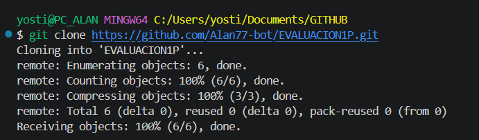

---

#### ¿Cómo se verificó que se estaba trabajando sobre el fork y no sobre el repositorio original?

Para verificar a qué repositorio remoto estaba conectado el proyecto ejecuté el siguiente comando:

```bash
git remote -v
```

Este comando mostró las direcciones configuradas para `fetch` y `push`.

En el resultado se observó que la dirección de `origin` correspondía al repositorio ubicado en mi cuenta personal de GitHub.

Por esta razón se comprobó que el repositorio local estaba conectado a mi **fork** y no directamente al repositorio original del docente.

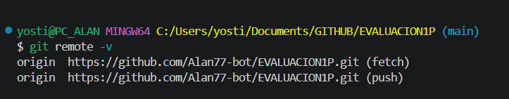

---

#### Verificación de la rama utilizada

Todo lo correspondiente a esta pregunta se realizó en la rama `main`.

Para verificar la rama actual ejecuté:

```bash
git branch
```

El resultado mostró:

```text
* main
```

Esto confirmó que el desarrollo de la Pregunta 1 se realizó en la rama `main`.

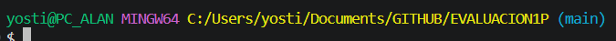


## Pregunta 2 (1 punto)

**Configurar un archivo `.gitignore` para que ignore:**

- Todos los archivos con extensión `.log`.
- Una carpeta llamada `temp/`.
- Todos los archivos `.md` y `.txt`de la carpeta `doc/`. (Probar agregando un archivo `prueba.md` y un archivo `prueba.txt` dentro de la carpeta y fuera de la carpeta.)

### Requisitos:

1. Realizar un **primer commit** que incluya únicamente el archivo `.gitignore` con las reglas de exclusión definidas.
2. Realizar un **segundo commit** que incluya las creación de los archivos de prueba.
2. Realizar un **tercer commit** donde se explique en este README la función del archivo `.gitignore` y se muestre evidencia de que los archivos y carpetas indicadas no están siendo rastreadas por Git.

**Importante:**  
- Solo el **tercer commit** debe llevar el **tag `"Pregunta 2"`**.

**📝 Respuesta:**

### Función del archivo `.gitignore`

El archivo `.gitignore` permite indicar a Git qué archivos y carpetas no deben ser rastreados ni incluidos normalmente en los commits del repositorio.

Para esta práctica se configuraron las siguientes reglas:

```gitignore
*.log
temp/
doc/*.md
doc/*.txt
```

Las reglas configuradas permiten:

- Ignorar todos los archivos con extensión `.log`.
- Ignorar los archivos que se encuentren dentro de la carpeta `temp/`.
- Ignorar los archivos `.md` que se encuentren dentro de la carpeta `doc/`.
- Ignorar los archivos `.txt` que se encuentren dentro de la carpeta `doc/`.


---

### Prueba de funcionamiento

Para comprobar el funcionamiento del archivo `.gitignore` se crearon archivos de prueba dentro y fuera de la carpeta `doc/`.

Los archivos utilizados fueron:

```text
prueba.md
prueba.txt
prueba.log
doc/prueba.md
doc/prueba.txt
temp/prueba.txt
```

Los archivos `prueba.md` y `prueba.txt` ubicados fuera de la carpeta `doc/` fueron detectados normalmente por Git.

En cambio, `doc/prueba.md` y `doc/prueba.txt` fueron ignorados debido a las reglas `doc/*.md` y `doc/*.txt`.

El archivo `prueba.log` fue ignorado mediante la regla `*.log`.

El archivo ubicado dentro de la carpeta `temp/` también fue ignorado debido a la regla `temp/`.

Para comprobar qué archivos estaban siendo ignorados se utilizó:

```bash
git status --ignored --untracked-files=all
```

También se ejecutó:

```bash
git check-ignore -v prueba.log doc/prueba.md doc/prueba.txt temp/prueba.txt
```

El resultado permitió comprobar qué regla del archivo `.gitignore` estaba ignorando cada archivo.


De esta manera se comprobó que las reglas configuradas en el archivo `.gitignore` funcionan correctamente y que los archivos y carpetas indicados no están siendo rastreados por Git.

## Pregunta 3 (2 puntos)

**Utilizar Git Flow para desarrollar una nueva funcionalidad llamada `ingresar-encabezado`.**

### Requisitos:

- Inicializar el repositorio con Git Flow, utilizando las ramas por defecto: `main` y `develop`.
- Crear una rama de tipo `feature` con el nombre `ingresar-encabezado`.
- En dicha rama, **completar con los datos personales del estudiante** el encabezado que ya se encuentra al inicio de este archivo `README.md`.
- Realizar al menos un commit durante el desarrollo.
- Finalizar el hotfix siguiendo el flujo de trabajo establecido por Git Flow.

### En la sección de respuesta, se debe incluir:

- Los **comandos exactos** utilizados desde la inicialización de Git Flow hasta el cierre de la rama.
- Una descripción del **proceso seguido**, indicando el propósito de cada paso.
- Una reflexión sobre las **ventajas de aplicar Git Flow**, especialmente en contextos colaborativos o proyectos de larga duración.

**Importante:**

- Deben realizarse varios commits durante esta pregunta.
- **Solo el commit final** debe llevar el **tag `"Pregunta 3"`**.
- El flujo debe respetar la estructura de Git Flow con las ramas `develop` y `main`.

**📝 Respuesta:**

### Desarrollo de la funcionalidad `ingresar-encabezado`

Para desarrollar la funcionalidad se utilizó una estructura de ramas basada en Git Flow, pero realizando el proceso manualmente mediante los comandos normales de Git.

Se utilizó la rama `main` como rama principal, `develop` como rama de desarrollo y una rama `feature/ingresar-encabezado` para trabajar de forma independiente en la nueva funcionalidad.

---

### Comandos utilizados

Los comandos utilizados desde la creación de las ramas hasta el cierre de la funcionalidad fueron:

```bash
git switch main
git branch develop
git switch develop
git switch -c feature/ingresar-encabezado
git branch
git add README.md
git commit -m "Pregunta 3: completar encabezado"
git add images/Pregunta_3
git commit -m "Pregunta 3: agregar evidencias"
git switch develop
git merge feature/ingresar-encabezado
git branch -d feature/ingresar-encabezado
git branch
```

---

### Proceso seguido

Primero se creó la rama `develop` a partir de la rama `main`. Esta rama se utilizó como espacio para integrar los cambios realizados durante el desarrollo.

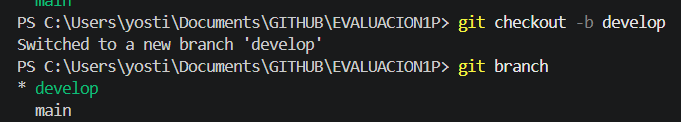

Posteriormente, desde `develop`, se creó una nueva rama llamada `feature/ingresar-encabezado` mediante el siguiente comando:

```bash
git switch -c feature/ingresar-encabezado
```

Esta rama permitió trabajar en la nueva funcionalidad sin modificar directamente las ramas `main` y `develop`.

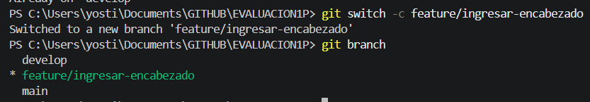

Dentro de la rama `feature/ingresar-encabezado` se modificó el encabezado del archivo `README.md` completándolo con los datos personales del estudiante.

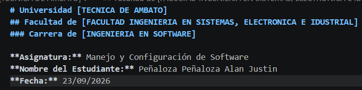

Durante el desarrollo se realizaron varios commits para guardar los diferentes avances realizados.


Una vez terminada la funcionalidad, se regresó a la rama `develop` y se fusionaron los cambios de la feature mediante:

```bash
git switch develop
git merge feature/ingresar-encabezado
```

Después de integrar correctamente los cambios, se eliminó la rama temporal:

```bash
git branch -d feature/ingresar-encabezado
```

De esta manera los cambios realizados durante el desarrollo quedaron integrados en la rama `develop`.

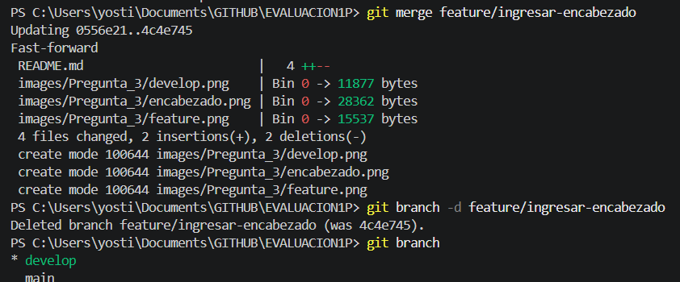

Finalmente se revisó el historial del repositorio para comprobar que los cambios fueron integrados correctamente.

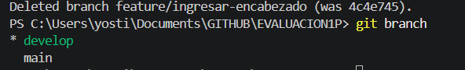

---

### Ventajas de trabajar con esta estructura de ramas

El uso de una estructura basada en Git Flow permite mantener organizado el desarrollo de un proyecto.

La rama `main` puede mantenerse como la versión principal o estable del proyecto, mientras que `develop` permite integrar los cambios que se encuentran en desarrollo.

Las ramas `feature` permiten desarrollar nuevas funcionalidades de manera independiente sin modificar directamente las ramas principales.

En proyectos colaborativos, esta forma de trabajo permite que varias personas desarrollen diferentes funcionalidades al mismo tiempo y reduce el riesgo de afectar el código estable.

También facilita el seguimiento de los cambios y la organización del proyecto cuando este tiene una duración prolongada.


## Pregunta 4 (2 puntos)

**Trabajo con Issues y Pull Requests**

### Parte teórica:

- ¿Qué es un Pull Request y cuál es su función dentro de un flujo de trabajo colaborativo con Git y GitHub?
- ¿Por qué es importante revisar un Pull Request antes de fusionarlo con la rama principal?
- ¿Qué tipo de observaciones o validaciones se suelen realizar durante la revisión de un Pull Request?

### Parte práctica:

- Trabajar en la rama `develop`, ya existente desde la configuración de Git Flow.
- Realizar los cambios necesarios en este archivo `README.md` para responder las preguntas.
- Realizar un **commit** con los cambios de la primera pregunta y subirlo a la rama `develop` del repositorio remoto.
- Crear un **pull request** desde `develop` hacia `main` en GitHub, con el nombre `"Pregunta 4 - Apellido Nombre"`.
- Crear comentarios solicitando: 1. que se agregue la respuesta de la segunda pregunta y luego agregando la respuesta con el respectivo commit; y 2. el mismo procedimiento para la tercera pregunta.
- **Aprobar** el pull request para que se haga el merge respectivo hacia `main`.

### En la sección de respuesta, se debe incluir:

- Un resumen del procedimiento realizado con las respectivas preguntas y capturas.
- El número y enlace al pull request.

**📝 Respuesta:**

### Parte teórica

### Parte teórica

#### ¿Qué es un Pull Request y cuál es su función dentro de un flujo de trabajo colaborativo con Git y GitHub?

Un **Pull Request** es una solicitud para integrar los cambios realizados en una rama hacia otra rama del repositorio.

Su función dentro de un trabajo colaborativo es permitir que los cambios sean revisados, comentados y validados antes de integrarlos a la rama principal. De esta manera, los integrantes del proyecto pueden revisar el trabajo realizado antes de realizar el merge.

---

#### ¿Por qué es importante revisar un Pull Request antes de fusionarlo con la rama principal?

Es importante revisar un Pull Request antes de realizar el merge porque permite detectar errores, conflictos o cambios que podrían afectar el funcionamiento del proyecto.

La revisión también permite comprobar que los cambios cumplen con los requisitos establecidos y que el código puede integrarse de manera segura a la rama principal.

---

#### ¿Qué tipo de observaciones o validaciones se suelen realizar durante la revisión de un Pull Request?

Durante la revisión de un Pull Request se pueden realizar diferentes validaciones, entre ellas:

- Verificar que los cambios cumplan con los requisitos solicitados.
- Revisar que el código sea claro y esté correctamente organizado.
- Comprobar que no existan errores o conflictos con otros cambios.
- Verificar que la funcionalidad implementada trabaje correctamente.
- Revisar que no se agreguen archivos innecesarios o información sensible.

---

### Procedimiento realizado

Para desarrollar esta pregunta se trabajó sobre la rama `develop`.

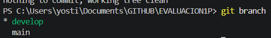

Primero se agregó la respuesta de la primera pregunta teórica al archivo `README.md`. Posteriormente se realizó un commit y se enviaron los cambios a la rama `develop` del repositorio remoto.

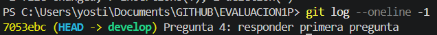

Después se creó un Pull Request desde la rama `develop` hacia la rama `main` con el nombre **"Pregunta 4 - Apellido Nombre"**.

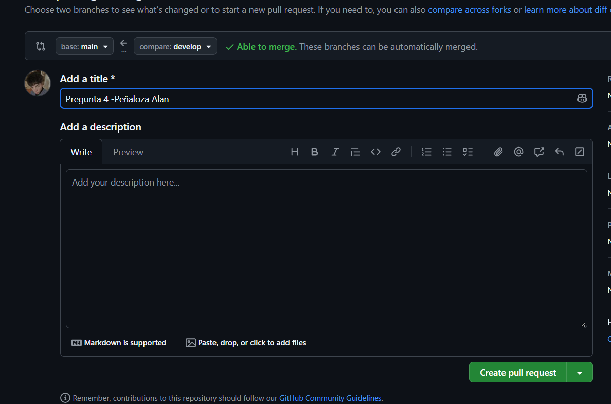

Dentro del Pull Request se realizó un comentario solicitando agregar la respuesta correspondiente a la segunda pregunta.

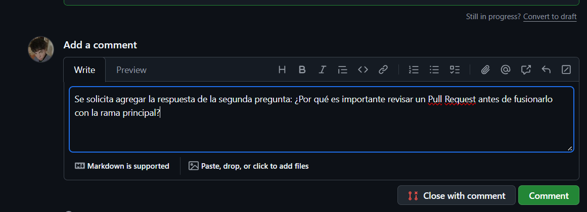

Luego se agregó la segunda respuesta al `README.md`, se realizó su respectivo commit y se enviaron nuevamente los cambios a la rama `develop`.

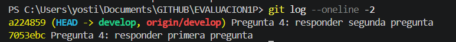

Posteriormente se realizó otro comentario en el Pull Request solicitando agregar la respuesta correspondiente a la tercera pregunta.

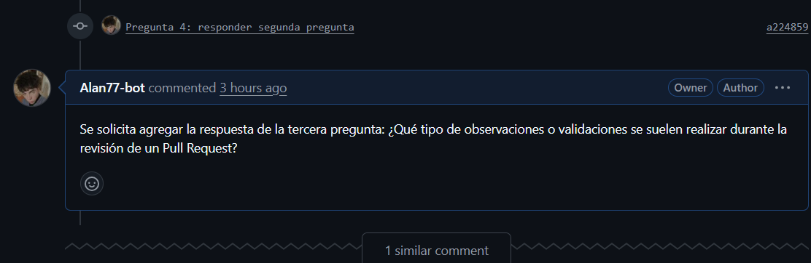

Finalmente se agregó la tercera respuesta y se completó la documentación de la actividad.

### Pull Request

- **Número del Pull Request:** #1
- **Enlace del Pull Request:** (https://github.com/TU-USUARIO/EVALUACION1P/pull/1)

## Pregunta 5 (2 puntos)

**Resolver conflictos entre ramas y realizar un Pull Request**

### Requisitos:

- Crear dos ramas llamadas `ramaA` y `ramaB`, ambas a partir de la rama `develop`.
- En `ramaA`, crear un archivo llamado `archivoA.txt` con el contenido:  
  `Contenido A`
- En `ramaB`, crear un archivo con el mismo nombre (`archivoA.txt`), pero con el contenido:  
  `Contenido B`
- Intentar fusionar `ramaB` sobre `ramaA`, lo cual debe generar un conflicto.
- Resolver el conflicto combinando ambos contenidos.
- Realizar el merge de `ramaA` hacia `develop`.
- Crear un **pull request** desde `develop` hacia `main`.
- Una vez completado lo anterior, eliminar las ramas `ramaA` y `ramaB`.

### En la sección de respuesta, se debe incluir:

- El procedimiento completo:
  - Cómo se crearon las ramas.
  - Cómo se generó y resolvió el conflicto.
  - Cómo se realizó el merge hacia `develop`.
  - Cómo se eliminaron las ramas al finalizar.
- El enlace al pull request.
- Una breve explicación de qué es un conflicto en Git y por qué ocurrió en este caso.

**📝 Respuesta:**

<!-- Escribe aquí tu respuesta completa a la Pregunta 5 -->

### Resolución de conflictos entre ramas

Para realizar esta práctica se trabajó a partir de la rama `develop` y se crearon dos ramas independientes llamadas `ramaA` y `ramaB`.

---

### Creación de las ramas

Primero se creó `ramaA` a partir de `develop` mediante:

```bash
git switch develop
git switch -c ramaA
```

Dentro de `ramaA` se creó el archivo `archivoA.txt` con el siguiente contenido:

```text
Contenido A
```

Posteriormente se realizó un commit con estos cambios.

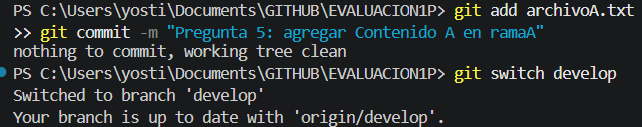

Después se regresó a `develop` y se creó `ramaB`:

```bash
git switch develop
git switch -c ramaB
```

En esta rama se creó un archivo con el mismo nombre `archivoA.txt`, pero con el contenido:

```text
Contenido B
```

Posteriormente se realizó su respectivo commit.

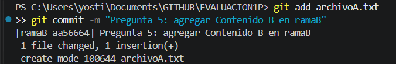

---

### Generación del conflicto

Para generar el conflicto se cambió nuevamente a `ramaA` y se intentó fusionar `ramaB` mediante:

```bash
git switch ramaA
git merge ramaB
```

Git detectó que las dos ramas habían creado el mismo archivo `archivoA.txt` con contenidos diferentes, por lo que no pudo decidir automáticamente qué contenido debía conservar y generó un conflicto.

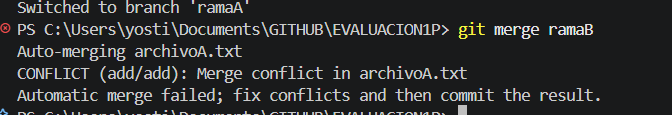

---

### Resolución del conflicto

El conflicto se resolvió combinando los contenidos de ambas ramas.

El archivo `archivoA.txt` quedó de la siguiente manera:

```text
Contenido A
Contenido B
```

Después se agregó nuevamente el archivo y se realizó un commit para registrar la resolución:

```bash
git add archivoA.txt
git commit -m "Pregunta 5: resolver conflicto entre ramaA y ramaB"
```

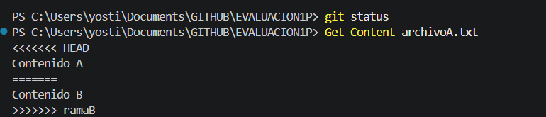

---

### Merge hacia `develop`

Una vez solucionado el conflicto se regresó a la rama `develop` y se fusionó `ramaA`:

```bash
git switch develop
git merge ramaA
```

De esta manera los cambios de ambas ramas quedaron integrados en `develop`.

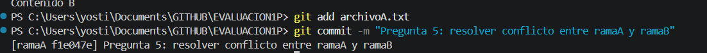

---

### Pull Request

Después de integrar los cambios en `develop`, se enviaron al repositorio remoto y se creó un Pull Request desde la rama `develop` hacia la rama `main`.

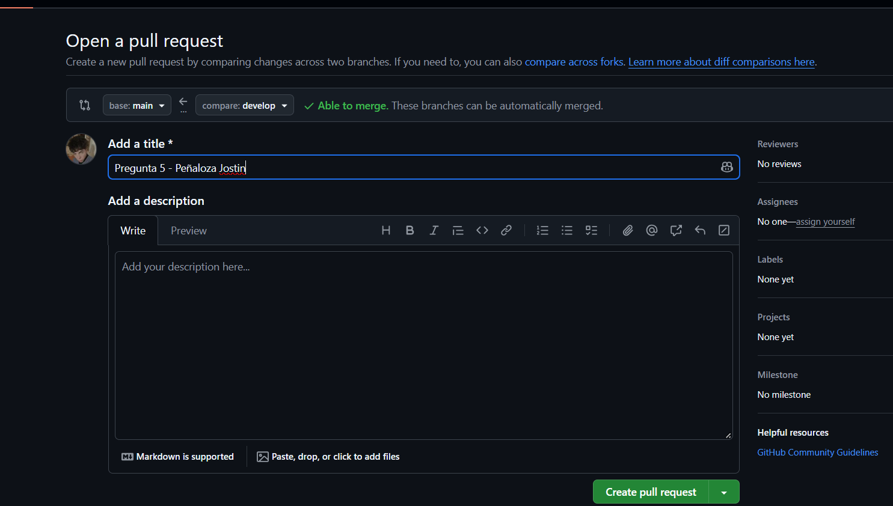

- **Número del Pull Request:** #NUMERO_PR
- **Enlace del Pull Request:** ENLACE_PR

---

### Eliminación de las ramas

Una vez terminado el proceso se eliminaron las ramas temporales utilizadas durante la práctica.

Los comandos utilizados fueron:

```bash
git branch -d ramaA
git branch -d ramaB
```

Después de eliminarlas se verificó que únicamente permanecieran las ramas principales del proyecto.

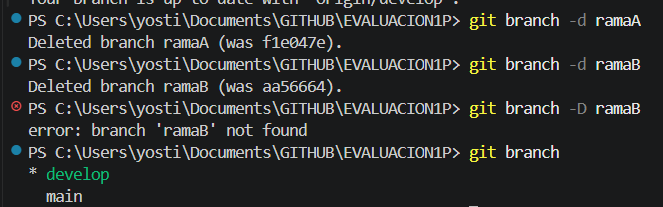

---

### ¿Qué es un conflicto en Git y por qué ocurrió en este caso?

Un **conflicto en Git** ocurre cuando Git encuentra cambios incompatibles entre dos ramas y no puede decidir automáticamente cuál de ellos debe conservar.

En este caso ocurrió porque `ramaA` y `ramaB` fueron creadas desde `develop` y ambas crearon un archivo llamado `archivoA.txt`, pero cada una tenía un contenido diferente.

`ramaA` contenía:

```text
Contenido A
```

Mientras que `ramaB` contenía:

```text
Contenido B
```

Al intentar fusionar `ramaB` sobre `ramaA`, Git detectó las dos versiones diferentes del mismo archivo y solicitó resolver el conflicto manualmente.

La solución consistió en conservar ambos contenidos dentro del archivo.

---

## Pregunta 6 (2 puntos)

**Realizar limpieza, explicar versionamiento semántico y enviar cambios al repositorio original**

### Requisitos:

- Trabajar en la rama `develop` del fork del repositorio.
- Eliminar los archivos `archivoA.txt` y `archivoB.txt` creados en preguntas anteriores.
- Realizar un merge desde `develop` hacia `main` en el repositorio local.
- Enviar los cambios de la rama `main` local a la rama `develop` del repositorio remoto (fork). Recuerde incluir todos los tags creados (6 tags).
- Finalmente, crear un **pull request** desde la rama `develop` del fork hacia la rama `main` del repositorio original (del cual se realizó el fork en la Pregunta 1). El titulo del pull request debe ser `"NOMBRE APELLIDOS"`, en la descripción colocar el link de su repositorio de GitHub.

### En la sección de respuesta, se debe incluir:

- Una explicación del proceso realizado paso a paso.
- Una explicación del **versionamiento semántico**, indicando:
  - En qué consiste.
  - Sus tres componentes (MAJOR, MINOR, PATCH).
- Si hace falta agregar alguna evidencia adicional, agregue un tag adicional que sea `Version Final`.

**📝 Respuesta:**

<!-- Escribe aquí tu respuesta completa a la Pregunta 6 -->

### Proceso realizado

Para realizar esta actividad se trabajó inicialmente sobre la rama `develop` del fork del repositorio.

Primero se verificaron y eliminaron los archivos `archivoA.txt` y `archivoB.txt` generados durante las actividades anteriores.

Para realizar la eliminación se utilizaron los siguientes comandos:

```bash
git switch develop
git rm archivoA.txt
git rm archivoB.txt
```

En caso de que alguno de los archivos no existiera, no fue necesario crearlo nuevamente, ya que el objetivo de esta actividad era realizar la limpieza de los archivos existentes.

Después de eliminar los archivos se verificaron los cambios mediante:

```bash
git status
```

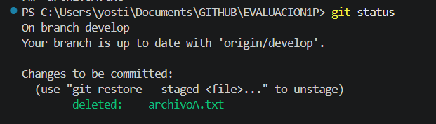

Posteriormente se registraron los cambios realizados mediante un commit.

Luego se cambió a la rama `main` y se realizó la integración de los cambios provenientes de `develop` mediante:

```bash
git switch main
git merge develop
```

De esta manera los cambios realizados durante el desarrollo quedaron integrados en la rama principal del repositorio local.

Después se enviaron los cambios de la rama `main` local hacia la rama `develop` del repositorio remoto mediante:

```bash
git push origin main:develop
```

Este comando permitió actualizar la rama `develop` del fork remoto utilizando el contenido actualizado de la rama `main` local.

Finalmente se enviaron al repositorio remoto todos los tags creados durante la evaluación mediante:

```bash
git push origin --tags
```

Después de actualizar el fork se creó un Pull Request desde la rama `develop` de mi fork hacia la rama `main` del repositorio original.

El Pull Request se creó utilizando mi nombre y apellidos como título y en la descripción se colocó el enlace correspondiente a mi repositorio de GitHub.

---

### Versionamiento semántico

El **versionamiento semántico** es una forma de identificar las diferentes versiones de un proyecto mediante tres números principales separados por puntos.

Su estructura es:

```text
MAJOR.MINOR.PATCH
```

Por ejemplo:

```text
2.4.1
```

Los tres componentes representan:

- **MAJOR:** Se incrementa cuando se realizan cambios importantes que pueden ser incompatibles con versiones anteriores.

- **MINOR:** Se incrementa cuando se agregan nuevas funcionalidades manteniendo la compatibilidad con la versión anterior.

- **PATCH:** Se incrementa cuando se realizan correcciones de errores o pequeños ajustes que mantienen la compatibilidad.

Por ejemplo, si un proyecto tiene la versión:

```text
1.2.3
```

`1` representa la versión **MAJOR**, `2` representa la versión **MINOR** y `3` representa la versión **PATCH**.

El uso del versionamiento semántico permite identificar de manera clara el tipo de cambios realizados entre diferentes versiones de un proyecto.
